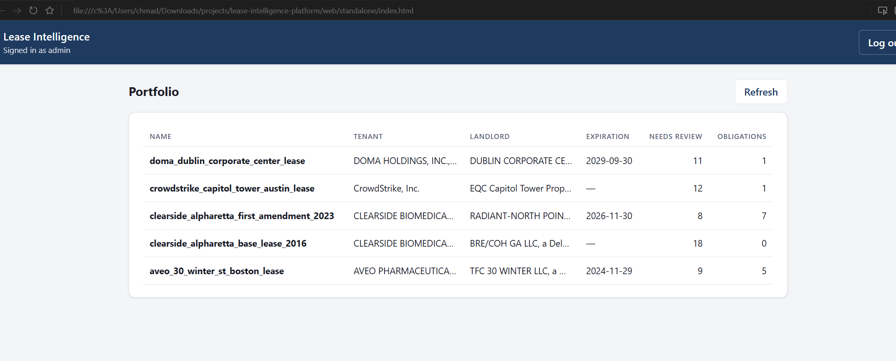
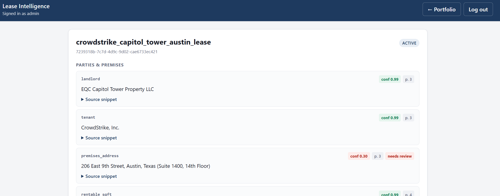

# Lease Intelligence Platform

Staff take-home for a CRE firm: ingest commercial lease PDFs, extract structured
terms with an LLM agent, and persist provenance-backed fields so critical dates
can be reviewed and acted on. **What is live today is the extraction API**
(auth, upload, extract, leases, fields, obligations) on Railway against Neon
Postgres. The React dashboard is a local scaffold only (not deployed). Q&A /
embeddings are optional and currently disabled. The Spring risk-engine is
scaffolded for compose, not the public Railway surface.

**Live:** https://lease-intelligence-platform-production.up.railway.app  
**Demo:** `admin` / `newmark`  
**API docs:** [/docs](https://lease-intelligence-platform-production.up.railway.app/docs) (Swagger)





---

## The problem

This serves **occupier lease administration** — corporate tenants running a
portfolio of leases. The failure mode that matters is a missed **renewal-notice
window**: miss it and the renewal right can be forfeited (seven-figure exposure).
Manual lease abstraction does not scale across amendments, inconsistent
drafting, and portfolio volume.

I chose this over alternatives I researched (**CAM reconciliation audit**,
**due-diligence data-room agent**) because the value is concrete and demoable:
low document count, very high dollar value per miss, and a clean split between
probabilistic extraction and deterministic deadline logic. CAM audit needs
invoice-level financial systems; a data-room agent is useful for search but does
not force provenance, confidence gating, and a rules path for legal deadlines.

---

## Architecture

```
                        ┌─────────────────────────────┐
  browser ──────────▶   │  gateway (nginx) :8080      │
                        │  /            → web         │
                        │  /api/auth/*  → extraction  │
                        │  /api/*       → extraction  │
                        │  /api/alerts* → risk-engine │
                        └──────┬──────────────┬───────┘
                               │              │
              ┌────────────────▼───┐   ┌──────▼────────────┐
              │ extraction-svc      │   │ risk-engine       │
              │ Python 3.12 FastAPI │   │ Java 21 Spring    │
              │ LangChain + Claude  │   │ Boot 3, @Scheduled│
              │ pgvector Q&A        │   │ deterministic     │
              └────────────┬────────┘   └──────┬────────────┘
                           │                   │
                        ┌──▼───────────────────▼──┐
                        │ Postgres (Neon, pgvector)│
                        │ single source of truth   │
                        └──────────────────────────┘
  web = React (Vite + TS) static build, served by gateway
```

*Diagram = full local compose target (`AGENTS.md` §3). Railway today exposes the
extraction service publicly; gateway / web / risk-engine are not on that URL.*

**Extraction pipeline:**  
`loader → sectioner → router → budget → extractor → guardrails → consolidator → persist`

- **Neon Postgres** is the single source of truth (local compose uses
  `pgvector/pgvector`).
- **Events:** append-only `events` table behind an `EventPublisher` interface —
  Kafka is an ops swap, not a code change.
- **Provenance + confidence** on every field (value, confidence, page, snippet,
  prompt version, model); `ConfidenceGate` marks `needs_review` below threshold.
- **Untrusted PDF text:** document body is data, never instructions;
  `InjectionScan` flags injection heuristics; prompts put lease text inside
  `<document>` delimiters.

---

## Assumptions and tradeoffs

- **Synchronous extraction** — fine for demo scale; long PDFs occupy a worker.
- **No OCR** — text-layer PDFs only; scanned pages are flagged, not invented.
- **Latest-wins** amendment consolidation — honest for the demo; real legal
  merge needs humans.
- **Single demo user** (JWT) — production path is OIDC.
- **Postgres-as-queue** instead of Kafka for events.
- **Embeddings / Q&A optional and currently disabled** — extraction still runs;
  Level 2–3 evals are stubbed.
- **Nested-schema non-determinism** (schedules, renewal options) handled by
  retry-with-reinforcement, request timeouts, and graceful degradation to null
  leaves + `needs_review` — not perfect yet.

---

## Evaluation

Full write-up: [`EVAL_REPORT.md`](EVAL_REPORT.md) (Level 1, offline vs gold,
`claude-sonnet-4-6`, prompt `v1.0`, 1 lease / 18 fields).

| Metric | Value |
|--------|-------|
| Overall field accuracy | **100%** |
| Page-citation accuracy | **100%** |
| Failures | **0** |

**Per-group:** parties, term, financial, options, opex — all 100% on this gold
lease (`crowdstrike_capitol_tower_austin_lease`).

**Confidence calibration:** the 0.0–0.5 bucket holds most low-confidence fields
(N=12, 100% observed accuracy here) — dominated by abstentions (null/empty at
confidence 0) that match gold, not invented values. The model declines rather
than hallucinates, which is what makes the `needs_review` queue meaningful.
(Some correct prose fields also sit at 0.3 after `CitationGuard`.)

**Known failure cases (this run):** none — every scored field passed.

---

## What I’d build next (ranked)

1. Reliability of nested-schema extraction (rent schedules, renewal options)
2. OCR lane for scanned pages
3. Tighter `CitationGuard` (over-penalizes correct fields to 0.3 on prose-heavy snippets)
4. Risk-engine + React dashboard to close the alert loop
5. Kafka for portfolio-scale ingest
6. OIDC auth
7. Drift monitoring on extraction confidence over time

---

## Running it

**Quick path:** open the live URL → `/docs` → Authorize with `admin` / `newmark`.

**Local:**

```bash
cp .env.example .env   # ANTHROPIC_API_KEY required for real extract/seed
docker compose up --build
```

App: http://localhost:8080 · Health: `/api/health` · Env names: [`.env.example`](.env.example)  
Deploy notes: [`deploy/railway.md`](deploy/railway.md)

```bash
cd services/extraction
python -m evals.stub <lease_id>
python -m evals.run --all    # refreshes EVAL_REPORT.md
```

### How this was built

Developed with AI assistance (Claude for design; Cursor / Opus for
implementation). Design decisions are recorded in
[`docs/DECISIONS.md`](docs/DECISIONS.md) as the engineering record — per the
assignment’s request to retain how the system was built with AI. Product
contract and conventions: [`AGENTS.md`](AGENTS.md).
